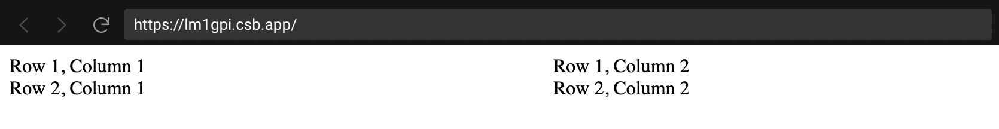
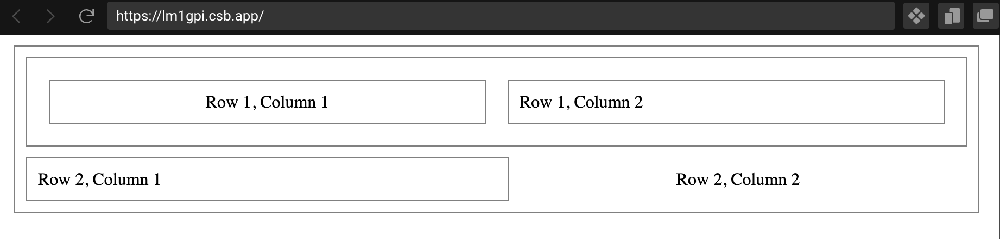

# 

*Hello, Grid!* is a minimalist, flexbox-based, grid system created to simplify the process of programming complex (and not so complex) layouts for modern web-applications using JSX.

Out of the box, *Hello, Grid!* contains **no initial styling, themes, or colors**. It's primary purpose is layout architecture and content arrangement, relying on your application to style your blueprint however you see fit.

## Installation
With npm:
```shell
npm i hello-grid
```

Or, with yarn:
```shell
yarn add hello-grid
```

## Getting Started
Once installed, you can start using *Hello, Grid!* to create layouts using it's Grid, Row and Column component hierarchy

```javascript
import { Grid, Row, Column } from "hello-grid";

const MyGrid = () => (
  <Grid>
    <Row>
      <Column>
        Row 1, Column 1
      </Column>
      <Column>
        Row 1, Column 2
      </Column>
    </Row>
    <Row>
      <Column>
        Row 2, Column 1
      </Column>
      <Column>
        Row 2, Column 2
      </Column>
    </Row>
  </Grid>
);
```

This should give you a result that looks extremely bare-bones, only using the flexbox styles to acheive what would look like this:


## Using Props
The same example above, when slightly altered using provided props like so:

```javascript
const MyGrid = () => (
  <Grid margin padded bordered>
    <Row padded bordered>
      <Column margin padded centered bordered>
        Row 1, Column 1
      </Column>
      <Column margin padded bordered>
        Row 1, Column 2
      </Column>
    </Row>
    <Row margin="top">
      <Column padded bordered>
        Row 2, Column 1
      </Column>
      <Column centered>
        Row 2, Column 2
      </Column>
    </Row>
  </Grid>
);
```
Can create a more visible, spaced out, and arranged blueprint to work from:

