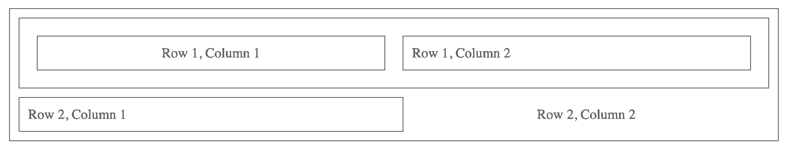

# 

*Hello, Grid!* is a minimalist, flexbox-based, grid system created to simplify the process of programming complex (and not so complex) layouts for modern web-applications using JSX.

Out of the box, *Hello, Grid!* contains **no initial styling, themes, or colors**. It's primary purpose is layout architecture and content arrangement, relying on your application to style your blueprint however you see fit.

## Installation
With npm:
```shell
npm i hello-grid
```

Or, with yarn:
```shell
yarn add hello-grid
```

## Getting Started
Once installed, you can start using *Hello, Grid!* to create layouts using it's Grid, Row and Column component hierarchy

```javascript
import { Grid, Row, Column } from "hello-grid";

const MyGrid = () => (
  <Grid>
    <Row>
      <Column>
        Row 1, Column 1
      </Column>
      <Column>
        Row 1, Column 2
      </Column>
    </Row>
    <Row>
      <Column>
        Row 2, Column 1
      </Column>
      <Column>
        Row 2, Column 2
      </Column>
    </Row>
  </Grid>
);
```

This should give you a result that looks extremely bare-bones, only using the flexbox styles to acheive what would look like this:


## Using Props
The same example above, when slightly altered using provided props like so:

```javascript
const MyGrid = () => (
  <Grid margin padded bordered>
    <Row padded bordered>
      <Column margin padded centered bordered>
        Row 1, Column 1
      </Column>
      <Column margin padded bordered>
        Row 1, Column 2
      </Column>
    </Row>
    <Row margin="top">
      <Column padded bordered>
        Row 2, Column 1
      </Column>
      <Column centered>
        Row 2, Column 2
      </Column>
    </Row>
  </Grid>
);
```
Can create a more visible, spaced out, and arranged blueprint to work from:


## Props list
### margin (boolean, string, array)
```javascript
margin || margin={true} || margin={false}
  // boolean. margin will be placed around the entire component

margin="top" || margin="bottom" || margin="left" || margin="right"
  // string. margin will only be placed on specified area

margin={["top", "bottom", "left", "right"]}
  // array. margin will be placed on all specified areas
```
### padded (boolean, string, array)
```javascript
padded || padded={true} || padded={false}
  // boolean. padding will be placed within the entire component

padded="top" || padded="bottom" || padded="left" || padded="right"
  // string. padding will only be placed within specified area

padded={["top", "bottom", "left", "right"]}
  // array. padding will be placed within all specified areas
```
### bordered (boolean, string, array)
```javascript
bordered || bordered={true} || bordered={false}
  // boolean. border will be placed over the entire component

bordered="top" || bordered="bottom" || bordered="left" || bordered="right"
  // string. border will only be placed over specified area

bordered={["top", "bottom", "left", "right"]}
  // array. border will be placed over all specified areas
```
### centered (boolean, string)
```javascript
centered || centered={true} || centered={false}
  // boolean. content within component will be centered both horizontal and vertical

centered="horizontal" || centered="vertical" 
  // string. content within component will be centered as specified
```
### flex (string)
`flex` acts as a shortcut to the `flex` CSS shorthand property. This is useful for defining your own ratios within Rows and Columns when you do not want them to be equally distributed. All other valid usage for `flex` can be found [in the official mdn documentation](https://developer.mozilla.org/en-US/docs/Web/CSS/flex).

## Fun / Experimental Props

### collapsible (boolean)
When `collapsible` is used, it identifies that the `Column` or `Row` can be collapsed. Currently, `Column` collapses horizontally and `Row` collapses vertically.

### collapsed (boolean)
When `true`, `collapsed` will collapse a `collapsible` grid component. If your grid component is already collapsed, toggling the `collapsed` prop will return the component to it's previous state.

## CSS-Variables

To customize the default values for the `padded`, `margin`, `bordered`, and `collapsible` props, CSS variables can be used. With these, your Grid layout can have the default stylings of your choosing application-wide for the their corresponding props.

```CSS
:root {
  --hello-grid-var-padding: 5px;
    /* default 10px */
  --hello-grid-var-margin: 5px; 
    /* default 10px */            
  --hello-grid-var-border: 2px solid gray;
    /* default 1px solid gray */  
  --hello-grid-var-border-radius: 5px;
    /* default 0 */
  --hello-grid-var-collapsible-transition: all 2000ms;
    /* default all 500ms */
}
```
